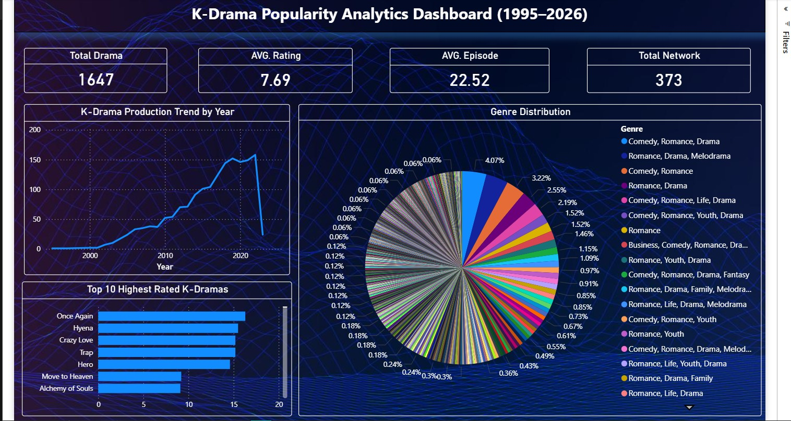
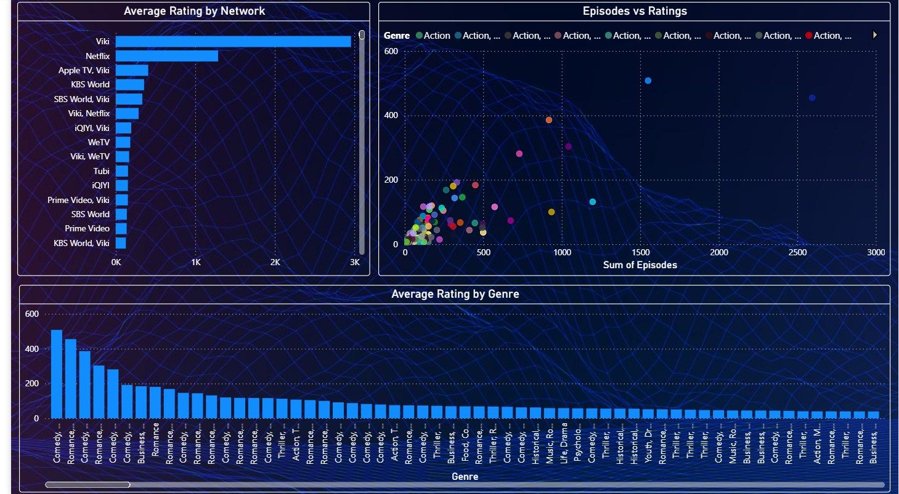

# K-Drama Popularity Analysis

## Overview
This project dives into what makes Korean dramas popular by analyzing various data points and presenting the findings visually. Using Python and Power BI, the goal was to identify patterns in ratings, genres, and the networks behind these dramas, helping to uncover what truly influences a show's success.

---

## Objectives
- Explore how ratings differ across different drama titles  
- Find out which genres tend to perform better consistently  
- Understand the impact of production networks on popularity  
- Create an interactive dashboard to clearly communicate these insights  

---

## Tools & Technologies
- Python (Pandas, Matplotlib)  
- Jupyter Notebook  
- Power BI  

---

## Dashboard Preview

### Overview  

### Network Insights  

### Rating Analysis  

---

## Project Structure
K_DRAMA_POPULARITY_PROJECT/  
&nbsp;&nbsp;&nbsp;&nbsp;├── dataset/ — Raw and cleaned data  
&nbsp;&nbsp;&nbsp;&nbsp;├── python/ — Analysis scripts  
&nbsp;&nbsp;&nbsp;&nbsp;├── powerbi/ — Dashboard file  
&nbsp;&nbsp;&nbsp;&nbsp;└── Images/ — Visual assets  

---

## Key Insights
- Certain networks consistently produce higher-rated dramas, highlighting the influence of production quality and resources  
- Genre plays a significant role in shaping audience preferences and ratings  
- The distribution of ratings shows clear patterns, indicating common viewer response trends  

---

## Future Improvements
- Develop a machine learning model to predict a drama's potential popularity  
- Deploy the dashboard for broader access and interactivity  
- Automate data collection and preprocessing to keep insights up to date  

---

## Author  
Shubham Panchal  
Aspiring Data Scientist & Analyst | Python | SQL | Machine Learning | EDA | Data Visualization | AI Projects  
