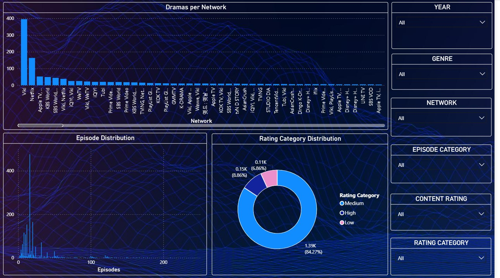

# K-Drama Popularity Analysis

## Overview
This project explores what influences the popularity of Korean dramas by analyzing data related to ratings, genres, and production networks. The idea was to move beyond raw numbers and understand patterns that explain why certain dramas perform better than others. Python was used for analysis, and Power BI was used to present the findings through an interactive dashboard.

---

## Objectives
- Analyze how ratings vary across different dramas  
- Identify genres that consistently perform well  
- Understand the role of production networks in popularity  
- Build a dashboard to present insights in a clear and interactive way  

---

## Tools & Technologies
- Python (Pandas, Matplotlib)  
- Jupyter Notebook  
- Power BI  

---

## Dashboard Preview

### Overview

 

### Network Insights

 

### Rating Analysis

---

## Project Structure
K_DRAMA_POPULARITY_PROJECT/  
├── dataset/ — Raw and cleaned datasets  
├── python/ — Data analysis scripts  
├── powerbi/ — Power BI dashboard file  
└── Images/ — Dashboard screenshots  

---

## Key Insights
- Some networks consistently produce higher-rated dramas, suggesting strong influence in content quality and reach  
- Genre plays a key role in popularity, with certain categories attracting more stable audience ratings  
- Ratings tend to follow a pattern, indicating common viewer preferences across different shows  

---

## Future Improvements
- Build a machine learning model to predict drama popularity  
- Make the dashboard accessible online  
- Automate data collection and updates  

---

## Author  
Shubham Panchal  
Aspiring Data Scientist & Analyst | Python | SQL | Machine Learning | EDA | Data Visualization | AI Projects  
